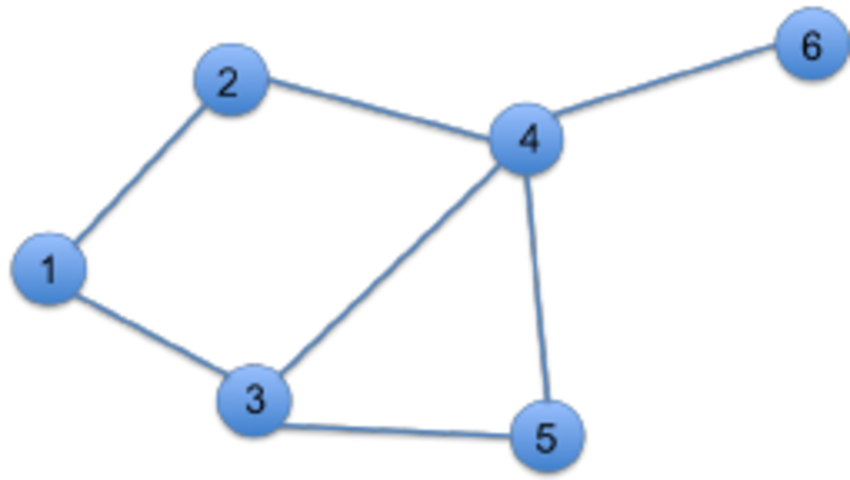

# Homework 3

## Toy Dataset

*Graph borrowed from [research gate].*

## Streaming Triangles

Two primary data structures:

- edge reservoir

        Uniform random sample of edges observed so far

- wedge reservoir

        Aims to select a uniform sample of wedges.
        Specifically, it maintains a uniform sample of the wedges created by the edge reservoir at any step of the process. (The wedge reservoir may include wedges whose edges are no longer in the edge reservoir.)

Two parameters:

- $s_e$ the size of the edge reservoir (pool)

- $s_w$ the size of the wedge reservoir (pool)

Two parts of the algorithm:

- Streaming-Triangle

- Update, invoked every time a new edge appears. After edge $e_t$ is processed here (i.e. the edge at time t), the algorithm computes running estimates for $k_t$ and $T_t$. Which don't have to be stored, but can be output directly.

**...to be continued...**

[research gate]: https://www.researchgate.net/figure/Example-graph-with-12-wedges-and-1-triangle_fig1_221666184

